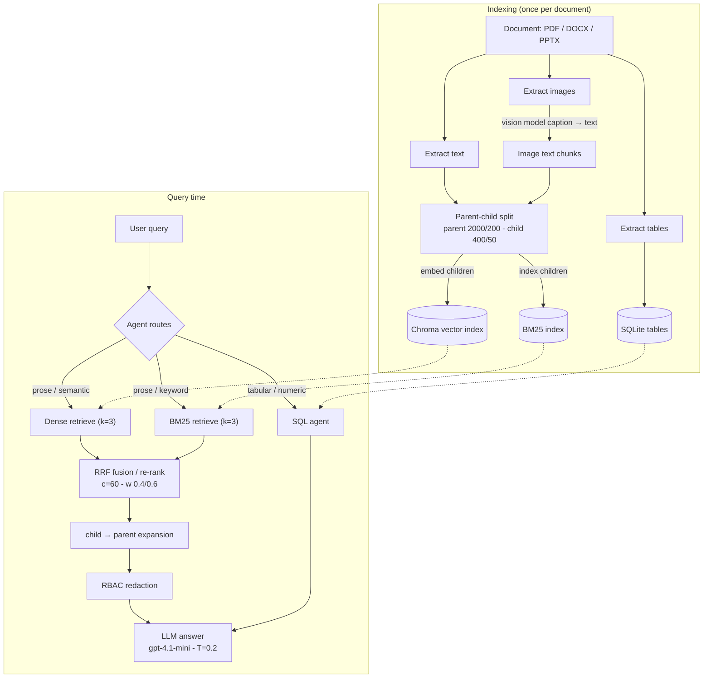

# Architecture & Retrieval Math

A theory-and-math reference for the **hybrid RAG pipeline**: how documents are turned into
an index, how a query is retrieved, and the mathematics behind each step (BM25, the RRF
re-ranking, dense similarity). This is a conceptual reference, not a code walkthrough.

> Companion document: **[EVALUATION.md](./EVALUATION.md)** — the math behind how this
> pipeline is *measured* (retrieval metrics, semantic similarity, keyword coverage,
> faithfulness, answer relevancy, ablation).

Formulas are written in LaTeX (renders on GitHub). Each one is restated in plain English so
it's readable anywhere. All constants below are the **actual values used in the code**.

---

## 1. Overview

The system is a **hybrid Retrieval-Augmented Generation** pipeline. It combines two
complementary retrievers — a **sparse** lexical one (BM25) and a **dense** semantic one
(embeddings) — and fuses their rankings with **Reciprocal Rank Fusion (RRF)**. Text is
indexed with **parent–child chunking** (small chunks for precise matching, large chunks for
rich context). Tables take a separate **SQL-agent** path, and an **RBAC** layer redacts
content above the user's clearance before it reaches the LLM.

---

## 2. Workflow

---

## 3. Ingestion & extraction

Three content types are pulled from each document and turned into **text** (everything the
retrievers see is text):

- **Text** — extracted per page/paragraph/slide (PDF, DOCX, PPTX).
- **Images** — captioned by a **vision model** into a structured description (type, summary,
  entities, keywords), which becomes text chunks. There is no classical OCR; the vision
  model does the "image → text" conversion.
- **Tables** — loaded as **rows into SQLite** (one table per detected table, named
  `page_X_table_Y`), with numeric columns auto-typed. Tables are *not* embedded; they are
  queried with SQL (see §10).

No formulas here — this stage is purely "get everything into text or a table."

---

## 4. Parent–child chunking

**Concept.** There is a tension in chunk size: *small* chunks match a query precisely (less
unrelated text to dilute the signal) but are too small to answer from; *large* chunks give
the LLM enough context but match queries fuzzily. Parent–child chunking resolves this by
**splitting twice**:

- **Parents** — large chunks (the unit of *context* given to the LLM).
- **Children** — small chunks (the unit of *retrieval* — what gets embedded and indexed).

Each child remembers which parent it came from. At query time we retrieve children, then
**expand each child to its parent** (§8) so the LLM reads the full context, not the snippet.

| Level | Size (chars) | Overlap (chars) | Role |
|-------|--------------|-----------------|------|
| Parent | 2000 | 200 | Context fed to the LLM |
| Child | 400 | 50 | Embedded + BM25-indexed; the retrieval unit |

Splitting uses recursive character splitting (paragraph → sentence → word boundaries).
Overlap keeps a sentence that straddles a boundary from being cut in half.

---

## 5. Dense retrieval (semantic)

**Concept.** Embed each child chunk and the query into the same vector space with
`text-embedding-3-small`; "semantically similar" = "vectors point in a similar direction."
The store is **Chroma**, queried for the top **k = 3** nearest children.

The natural similarity is **cosine similarity**:

$$\cos(a,b)=\frac{a\cdot b}{\lVert a\rVert\,\lVert b\rVert}=\frac{\sum_i a_i b_i}{\sqrt{\sum_i a_i^2}\,\sqrt{\sum_i b_i^2}}$$

*In words:* the dot product of the two vectors divided by their lengths — i.e. the cosine of
the angle between them. Range $[-1,1]$; higher = more similar.

**Implementation nuance (so the math is exact).** Chroma is created without overriding its
distance metric, so it actually ranks by its **default squared Euclidean (L2) distance**:

$$\lVert a-b\rVert^2 = \lVert a\rVert^2 + \lVert b\rVert^2 - 2\,(a\cdot b)$$

OpenAI's embeddings are returned **unit-normalized** ($\lVert a\rVert=\lVert b\rVert=1$),
which collapses the relationship to:

$$\lVert a-b\rVert^2 = 2 - 2\cos(a,b)$$

So **smaller L2 distance ⇔ larger cosine** — the retrieval *ranking* is identical whether
Chroma uses L2 or cosine. That is why it is correct to think of the dense path as
"cosine retrieval" even though the backend metric is L2.

| Setting | Value |
|---------|-------|
| Embedding model | `text-embedding-3-small` (1536-dim, unit-normalized) |
| Vector store | Chroma (default = squared L2; rank-equivalent to cosine here) |
| Search type / `k` | `similarity` / 3 |

---

## 6. Sparse retrieval — BM25 (the math behind BM25)

**Concept.** BM25 is a **lexical** ranking function: it scores a document by how often the
query's *words* appear in it, rewarding rare words, dampening repeated words, and correcting
for document length. It does not understand meaning — only term overlap — which makes it the
perfect complement to the dense retriever. The implementation is **`BM25Okapi`** from
`rank_bm25` (via LangChain's `BM25Retriever`, top **k = 3**), with whitespace tokenization
and library-default parameters **$k_1 = 1.5$, $b = 0.75$**.

For a document $D$ and query $Q$ (a bag of terms $q$):

$$\text{score}(D,Q)=\sum_{q\in Q}\text{IDF}(q)\cdot\frac{f(q,D)\,(k_1+1)}{f(q,D)+k_1\!\left(1-b+b\,\dfrac{|D|}{\text{avgdl}}\right)}$$

with the Okapi inverse document frequency

$$\text{IDF}(q)=\ln\!\left(\frac{N-n(q)+0.5}{n(q)+0.5}\right)$$

*Symbols:*

| Symbol | Meaning |
|--------|---------|
| $f(q,D)$ | term frequency — how many times term $q$ occurs in document $D$ |
| $\lvert D\rvert$ | length of $D$ in tokens |
| $\text{avgdl}$ | average document (chunk) length in the corpus |
| $N$ | total number of documents (child chunks) |
| $n(q)$ | number of documents containing $q$ |
| $k_1=1.5$ | **term-frequency saturation** — bigger $k_1$ lets repeated words keep adding score; as $f$ grows the term saturates toward $(k_1{+}1)$ |
| $b=0.75$ | **length normalization** — $b=1$ fully penalizes long docs, $b=0$ ignores length |

*In words:* sum over query terms of (rarity of the term) × (a length-normalized, saturating
count of that term in the document). Rare terms that appear several times in a short chunk
score highest.

**Negative-IDF floor.** The Okapi IDF goes *negative* for terms appearing in more than half
the documents. `BM25Okapi` clamps those to `epsilon × average_idf` (default
**$\varepsilon = 0.25$**) so ubiquitous words can't subtract from the score.

| Setting | Value |
|---------|-------|
| Library / class | `rank_bm25` · `BM25Okapi` (via LangChain `BM25Retriever`) |
| Tokenization | whitespace `.split()` |
| `k1` / `b` / `epsilon` | 1.5 / 0.75 / 0.25 (defaults) |
| Top `k` | 3 |

---

## 7. Hybrid fusion = the RRF re-ranking

**The re-ranking step.** BM25 scores and cosine/L2 distances live on **completely different
scales**, so you can't just add them. **Reciprocal Rank Fusion (RRF)** sidesteps this by
ignoring the raw scores and using only each item's **rank** within each retriever's list.
This is the re-ranking performed *inside* LangChain's `EnsembleRetriever`.

For a candidate document $d$:

$$\text{RRF}(d)=\sum_{r\in\{\text{bm25},\ \text{dense}\}} w_r\cdot\frac{1}{c+\text{rank}_r(d)}$$

*In words:* each retriever $r$ contributes $w_r / (c + \text{rank})$, where `rank` is $d$'s
1-indexed position in that retriever's results (rank 1 = top). Add the contributions; sort
all candidates by descending RRF score.

*Symbols & constants:*

| Symbol | Meaning | Value |
|--------|---------|-------|
| $\text{rank}_r(d)$ | 1-indexed position of $d$ in retriever $r$'s list (rank 1 = best) | — |
| $c$ | RRF constant — flattens the gap between top ranks so no single retriever dominates | **60** |
| $w_{\text{bm25}}$ | weight of the BM25 list | **0.4** |
| $w_{\text{dense}}$ | weight of the dense list | **0.6** |

Key behaviors:

- **Union of candidate sets.** Both retrievers' results are pooled; an item retrieved by
  only one retriever simply contributes from that one list (its rank in the other is treated
  as absent → contributes 0).
- **Rank, not score.** Because only ranks enter the formula, BM25's unbounded scores and the
  dense path's $[0,1]$-ish similarities never have to be reconciled.
- **The constant $c=60$** means rank 1 contributes $1/61$ and rank 2 contributes $1/62$ —
  close together. A larger $c$ makes the fusion rely more on *appearing in both lists* than
  on *being #1 in one list*.
- **Weights** tilt the fusion toward the dense retriever (0.6 vs 0.4) — the default guess
  for this corpus; **[EVALUATION.md §6](./EVALUATION.md#6-retrieval-ablation--weight-sweep)**
  describes how that weighting is stress-tested.

> Implementation note: the actual fused ordering comes from `EnsembleRetriever`. The code
> also recomputes this *same* formula (same $c=60$, same weights, over each retriever's top
> candidates) purely to **log** per-candidate RRF scores for transparency — it does not
> change the ranking.

---

## 8. Parent expansion

The fused result is a ranked list of **child** chunk ids. Each child is swapped for its
**parent** chunk, de-duplicated by parent id (two children of the same parent collapse to
one). This is the small→large step that gives the LLM full context while keeping retrieval
precise. No formula — a lookup `child_id → parent`.

---

## 9. RBAC redaction

**Concept.** Access control by **clearance ordering**. Every parent chunk is tagged at index
time with a sensitivity tier; every role maps to a clearance level. A chunk is shown only if
its sensitivity does not exceed the user's clearance:

$$\text{visible}(d,\text{role}) \iff \text{sensitivity}(d)\ \le\ \text{clearance}(\text{role})$$

with the ordering

$$\text{public}(0)\ <\ \text{internal}(1)\ <\ \text{confidential}(2)$$

(e.g. `guest → public`, `employee → internal`, `manager → confidential`). If a chunk is
above clearance, its PII is masked and it is returned wrapped as `[RESTRICTED]` — signaling
an **access block** (so the agent stops retrying) rather than a retrieval miss. Sensitivity
is assigned from detected PII (strong PII → confidential, mild PII → internal, none →
public); that detection runs locally.

---

## 10. Table / SQL-agent path

Tables bypass the whole retrieve-and-fuse pipeline. They are stored as **SQLite** tables
(`page_X_table_Y`). For a tabular/numeric question the agent: (1) inspects the available
table schemas, then (2) writes and runs a **SQL** query. This path does **no** embedding,
**no** RRF, and **no** RBAC redaction — it is exact, structured lookup, which is the right
tool for "what is the average salary in Engineering?" style questions.

---

## 11. Generation

The retrieved-and-redacted parent context (and/or SQL results) is handed to the answering
LLM **`gpt-4.1-mini`** at **temperature 0.2**, which composes the final response. Low
temperature keeps answers deterministic and grounded in the provided context.

---

## 12. Constants summary

| Component | Constant | Value |
|-----------|----------|-------|
| Parent chunk | size / overlap | 2000 / 200 chars |
| Child chunk | size / overlap | 400 / 50 chars |
| Embeddings | model | `text-embedding-3-small` |
| Dense retriever | metric / `k` | L2 (≡ cosine, normalized) / 3 |
| BM25 | `k1` / `b` / `epsilon` / `k` | 1.5 / 0.75 / 0.25 / 3 |
| RRF | constant `c` | 60 |
| RRF | weights (bm25 / dense) | 0.4 / 0.6 |
| Vector store | — | Chroma |
| Tables | backend / naming | SQLite / `page_X_table_Y` |
| RBAC | tiers | public(0) < internal(1) < confidential(2) |
| Generation | model / temperature | `gpt-4.1-mini` / 0.2 |
| Image captioning | model | vision model (GPT-4o class) |

*All values reflect the current code.*
